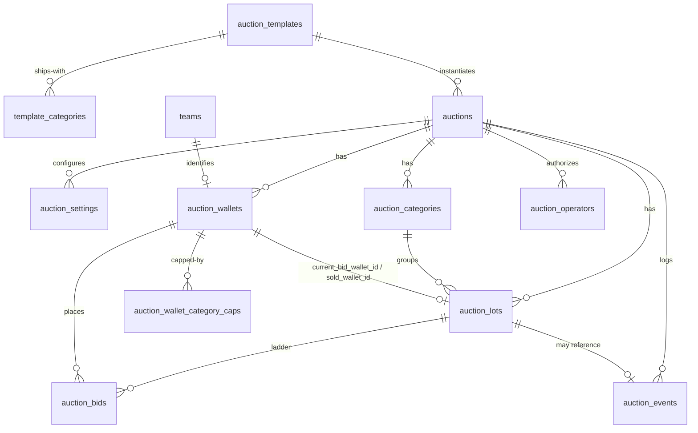

# AuctionOS

A living reference for the auction platform being built inside this repo.
Update this file at the end of every phase — it should always describe the
system as it actually exists, not as it was originally planned.

## What this is

AuctionOS is a generic, reusable live-auction engine, built to work as a
platform an organizer *configures* rather than a codebase they fork. It is
**not** a JCC feature — JCC's player auction is the first of potentially
several **templates** built on top of a shared engine. Nothing format-
specific (currency, bid-increment rules, eligibility checks, visual
identity) is allowed to live in the engine; it belongs inside a template.
Nothing *organizer-tunable* (which categories exist, per-auction settings,
who's bidding, spectator visibility) is allowed to live in code either — it
belongs in the database, as rows a template seeds and an organizer edits.

Design priority for this project, per direction from the project owner:
**architecture over speed.** Every phase goes design → tradeoffs → implement
→ refactor, not straight to code. See "How phases work" below.

## Current status

**Schema v3 — SaaS platform pass: built AND applied to Supabase.**
`supabase/add_auctionos.sql` was rewritten (v2 was never applied to a live
database either, so this remained a clean-slate rewrite, not a migration)
to remove the last JCC-shaped assumptions from what was otherwise already a
DB-backed catalog: captains moving off the global `teams` table onto their
own auction-scoped table, wallets splitting into a shared "kind" concept
plus per-team instances, roles becoming free text with fixed engine-defined
capability grants, and money/purchases getting a real append-only ledger
instead of a mutated column. It has now actually been run against the live
Supabase project (via `psql`, since the file's ~20 statements — including
plpgsql function bodies with embedded semicolons — can't go through a single
prepared statement the way `supabase db query -f` sends them; `psql`
streams statements one at a time and has no such limit). The file is
written to be safely re-run (`CREATE TABLE IF NOT EXISTS`, `CREATE OR
REPLACE FUNCTION`, `DROP POLICY IF EXISTS` before every `CREATE POLICY`) —
a second full run produces zero errors.

**Command/query security boundary — implemented at the database, not left
to RLS.** Every one of the 10 functions in `add_auctionos.sql` is a
mutating command (there are no read-only query RPCs — reads already go
straight from the browser to Supabase tables via RLS). Each command now has
an explicit `REVOKE EXECUTE ... FROM PUBLIC, anon, authenticated` +
`GRANT EXECUTE ... TO service_role` pair immediately after its definition,
so only a Next.js route holding the service-role key can invoke it —
this was previously missing entirely, meaning any caller with the public
anon key could *attempt* to call these RPCs directly over HTTP and only
happened to fail because no RLS policy granted `anon` write access. See
§8 below for the full reasoning.

**`start/route.ts` create-auction bug — found and fixed.** The route
destructured a `wallets` field from the request body and forwarded it to
`auctionos_create_auction`, but the RPC (and the JCC frontend that calls
it) both use `team_ids` + `wallet_kinds`. The route was silently dropping
both, so any auction created through it would have zero `auction_wallets`
rows — creation would "succeed" but every subsequent bid would fail with
"wallet not found." Fixed to destructure and forward `team_ids`/
`wallet_kinds` correctly, with `team_ids` now a required, validated field.

The full v2 → v3 design discussion (re-evaluation, ER model, and every
tradeoff) happened in-conversation, not as a document — the "Generic domain
model" and "Template catalog" sections below are that discussion's outcome,
written as the schema's permanent description. See "Known risk" for what
still hasn't been pressure-tested.

**Template system — implemented, DB/code split unchanged in shape.** A
template is still a code module (`lib/auctionos/templates/<id>/`) assembled
by `defineTemplate()` from independent, overridable modules — only the
*algorithmic* modules stay in code (`auctionOrder`, `bidIncrements`,
`validation`, `floorPrice`, `valuation`, `allocation`, `permissions`, plus
currency formatting via `wallet.formatAmount`). `reserve`/`computeReserve`
is renamed `floorPrice`/`computeFloorPrice` this pass — see "Floor Price vs.
Reserve" below for why the old name was actively misleading. The *data*
modules (`categories`, starting `wallet` budget) are gone from the code
contract entirely — categories are `auction_categories` rows (seeded from
`template_categories` at auction-creation time) and a wallet's starting
budget is whatever `auction_wallet_kinds.initial_balance` the organizer set
when the auction was created. See "Template catalog" below for the full
design.

Two templates are still registered: `jcc` (every algorithmic module
populated with real JCC values) and `blank` (every module left at the
engine's neutral default).

## Landing philosophy

Route moved from `/auction` to `/auctionos` — the codebase's own name for
the product, not JCC's name for a feature. This wasn't just a URL rename:
it's the first concrete step of treating AuctionOS as a commercial SaaS
surface, not a JCC page, and the rule going forward is that **every future
AuctionOS UI decision defaults to this posture** unless a specific reason
says otherwise.

- **The landing page (`app/auctionos/page.tsx`) shows nothing about any
  auction** — no name, no lot count, no team list, no countdown, nothing.
  It's a front door with exactly two actions: enter an auction code, or
  (organizer) prepare the next auction. This is deliberate even though it
  makes the page "boring" — a public status page for a private auction is
  itself the leak.
- **DB delta applied via `supabase/add_auctionos_access_code.sql`, not a
  re-run of `add_auctionos.sql`.** The v3 schema file stays the full,
  from-scratch reference (per its own header, safely re-runnable end to
  end) but re-pasting all ~1300 lines for a 3-statement change is real
  friction the organizer shouldn't have to pay every pass. This repo's
  established convention is one small `add_*.sql` per change (see
  `add_tournament_code.sql`, `add_governance_fields.sql`, etc.) — this
  pivot now has one too. It also backfills `access_code` on any
  pre-existing auction row so the code-entry flow has something to test
  immediately.
- **The auction code is the only way in.** `auctions.access_code` is a
  6-char human-typeable code, generated server-side in
  `auctionos_create_auction` and returned exactly once, in that RPC's
  response — there is no other retrieval path, so the organizer must copy
  it out at creation time (`AuctionExperience` shows it in a dismissible
  banner right after a successful `handleStartAuction`). `/api/auctionos/
  resolve-code` is the only thing that can turn a code into an auction id;
  it never returns the code itself, so knowing an id doesn't get you the
  code back.
- **`auctions` has no public RLS read policy anymore** (`supabase/
  add_auctionos.sql` §2/§18) — the table cannot be listed or enumerated by
  an anon client at all, not even "show me the currently active one."
  Every read of it goes through a service-role route: `/api/auctionos/
  current` (the browser-facing "what's the current auction" poll,
  `access_code` stripped from its response) or a server component reading
  `supabaseAdmin` directly (`app/auctionos/hall/page.tsx`).
  `lib/auctionos/core/data.ts`'s `fetchActiveAuction()` now calls the
  former — it's browser-only for this reason; a server caller must query
  `supabaseAdmin` itself rather than round-tripping through the app's own
  API.
- **`HallAccessGate` (`components/auctionos/HallAccessGate.tsx`) fronts
  `/auctionos/hall`** — a client-side check (sessionStorage: either a code
  verified for this specific auction id, or the same `jcc_admin_password`
  key `AuctionExperience`'s own admin gate already uses) that bounces back
  to `/auctionos` on failure. This is a product-surface gate, not a
  security boundary — see "Known risk" below for what it does not cover.
- **Scope of this pass, deliberately narrow:** the underlying auction
  experience is still built around exactly one global "current" auction
  (`fetchActiveAuction()`'s single-row query), unchanged. A code currently
  answers "may this visitor see the product surface at all," not "which of
  several concurrent auctions does this visitor belong to" — true
  multi-tenant, many-simultaneous-coded-auctions is future work (see
  Roadmap), not something this pass silently half-implements.
- **Known gap, not yet closed:** `auction_wallets`, `auction_lots`, and
  `auction_categories` still have public RLS read policies scoped only by
  `auction_id` (a UUID) — anyone who already has that id (not the access
  code — the id) can read them directly via the anon Supabase client,
  bypassing the code gate entirely. This was true before this pass too;
  it's called out here explicitly rather than left implicit, because "the
  auction code is the only way in" is no longer quite accurate until this
  is closed. The real fix is the same multi-tenant/RLS-by-session work as
  the point above, not a narrow patch on these three tables alone.

## Architecture

### Layering

```
supabase/add_auctionos.sql        generic schema + RPCs (no format knowledge)
lib/auctionos/core/               generic engine: types, template contract, registry, reads
app/api/auctionos/*               generic API routes (resolve template server-side, call RPCs)
lib/auctionos/templates/<id>/     one folder per format — the ONLY place format ALGORITHMS live
components/auctionos/             generic, template-agnostic presentational pieces
app/auctionos/page.tsx             the SaaS landing — code entry + prepare, no auction details (see "Landing philosophy")
app/auctionos/hall/page.tsx        resolves active auction → template → module_key, renders template.AuctionExperience
```

The rule of thumb: if a piece of code needs to know what "lakhs" or a
"paddle" is, it belongs under `lib/auctionos/templates/jcc/`, never under
`lib/auctionos/core/` or `app/api/auctionos/`. If a piece of *data* is
something an organizer would reasonably want to edit without redeploying
(a category's name, an auction's starting budgets, whether spectators see
reserve prices), it belongs in a table, not a code constant.

### Floor Price vs. Reserve

Two concepts used to share the name "reserve" and got confused because of
it. As of schema v3 they're permanently split:

- **Floor Price** (`auction_categories.floor_price`, renamed from v2's
  `reserve_price`) — the minimum opening bid for a lot in a category.
  Organizer-editable, stored config, computed by nothing — a template's
  `floorPrice.computeFloorPrice()` just reads it (falling back to a
  code-level ladder if unset, same as before the rename).
- **Reserve** — the live, wallet-level required holdback: `remaining
  mandatory slots × current base prices`, summed across a wallet's
  categories. **Never stored anywhere in this schema.** It's generic enough
  (reads only `auction_categories.min_required`/`base_price`,
  `player_purchases`) that it isn't part of the per-template contract at
  all — it's a shared Reserve Engine function (`lib/auctionos/core/reserve.ts`),
  not something a template overrides. See §16 below for the enforcement path.

### Generic domain model

- **Team** (`public.teams`) — global, site-wide roster of bidding teams, NOT
  auction-scoped. Mirrors `lib/teams.ts`'s `TeamConfig` shape as DB rows so
  `auction_wallets.team_id` can be a real foreign key instead of an opaque
  string. `lib/teams.ts` itself and its other consumers (tournament, toss
  pages) are untouched — only AuctionOS's wallet table is wired to this
  table. `captain_player_id` (a v2 column) is **gone** — see AuctionCaptain
  below for why a captain moved off this table entirely.
- **Template catalog** (`auction_templates` + `template_categories` +
  `template_wallets`) — see its own section below.
- **Auction** (`public.auctions`, was `Season`) — one running auction.
  `template_id` is a real FK into `auction_templates`. No `config` JSONB —
  organizer-tunable settings are the typed `auction_settings` row below.
- **AuctionSettings** (`public.auction_settings`) — the single configuration
  source for an auction: every organizer-facing toggle lives here unless
  there's a strong relational reason it can't (captains have identity and
  relationships, so they're their own table; whether the captain module is
  *on* is still a setting: `captain_module_enabled`). Typed columns:
  `max_teams`, `allow_operator_bids`, `undo_enabled`,
  `captain_module_enabled`, `unsold_round_enabled`, `allocation_enabled`,
  `auction_order_mode`, `show_floor_price_to_spectators` (renamed from
  `show_reserve_to_spectators` — see "Floor Price vs. Reserve"),
  `show_wallets_to_spectators`, `show_valuation_to_operators`, plus a
  `spectator_visibility` JSONB escape hatch.
- **AuctionWalletKind** (`public.auction_wallet_kinds`) — NEW in v3. The
  shared, auction-scoped wallet concept a category points at (e.g. "Main
  Purse"). Copied from `template_wallets` at creation time, same
  copy-not-reference semantics as categories. This exists because
  `auction_categories` is one row shared by every team, but a wallet used
  to be one row *per team* — a category can't point at a single team's
  wallet row and still mean "each team's own purse for this category." A
  kind is the thing a category legitimately points at; every team gets its
  own instance of it (below).
- **AuctionCategory** (`public.auction_categories`) — live, organizer-
  editable per-auction categories. Seeded once from `template_categories`
  (or the creation payload), then fully independent. New in v3:
  `wallet_kind_id` (FK into `auction_wallet_kinds` — **this is the
  Category → Wallet direction**, the source of truth; a wallet's "assigned
  categories" is purely the reverse query, never a field written from the
  wallet side), `icon`, `min_required`/`max_allowed` (squad requirements).
- **AuctionWallet** (`public.auction_wallets`, was `Participant`) — one row
  per **(team, wallet kind)** per auction, no longer one row per team.
  `team_id` (FK into `teams`) + `wallet_kind_id` (FK into
  `auction_wallet_kinds`) together identify it. `budget_total` /
  `budget_remaining` / `acquired_count` are now CACHED values, kept in sync
  by the same RPC that appends a `wallet_transactions` row — `wallet_
  transactions` is the source of truth, this column is a read
  optimization. `metadata` (JSONB) is still the escape hatch for
  template-specific fields.
- **AuctionWalletCategoryCap** (`public.auction_wallet_category_caps`) —
  optional, organizer-set per-category spend/lot caps *on top of* whatever a
  wallet's kind already funds. Empty by default; not read by any RPC yet —
  a future `validateBid` hook is the natural place to enforce these.
- **AuctionCaptain** (`public.auction_captains`) — NEW in v3, auction-scoped.
  Zero rows for any auction whose template/settings doesn't enable the
  captain module (`auction_settings.captain_module_enabled`). Tied to
  `team_id` (not a specific wallet row) + `category_id` — "that captain's
  team's purchases in that category" is resolved through `auction_wallets`
  (matching `team_id` + the category's `wallet_kind_id`) at valuation time,
  because which kind funds a category is the category's decision, not
  something a captain row should hardcode. `UNIQUE(auction_id, team_id)`:
  one captain per team, occupying exactly one category slot.
- **AuctionLot** (`public.auction_lots`, was `Lot`) — one item up for
  auction. `category_id` FK, `version` (optimistic lock). `sold_price`/
  `sold_wallet_id`/`sold_at` are now CACHED from the latest unreversed
  `player_purchases` row (see below) — kept here anyway since the lot card
  is the hottest read in the app (polled every 4s). `external_ref` still has
  **no FK** — the engine must never know a table like `players` exists;
  this is also why AuctionOS does **not** have a generic `Players` table
  (see "Auction Lots stay generic" below) — anything a template wants to
  display is denormalised into `metadata` at creation time.
- **AuctionBid** (`public.auction_bids`, was `Bid`) — append-only audit
  trail of every raise. Unchanged from v2.
- **PlayerPurchase** (`public.player_purchases`) — NEW in v3, SOURCE OF
  TRUTH for "who bought what, for how much." `auction_lots.sold_*` is a
  cache over the latest row here with `reversed_at IS NULL`. Undo never
  deletes a row — it stamps `reversed_at`, so reversed purchases stay in
  history and the Captain Valuation Engine's "highest qualifying purchase"
  query is just `WHERE reversed_at IS NULL`.
- **WalletTransaction** (`public.wallet_transactions`) — NEW in v3, SOURCE
  OF TRUTH financial ledger. `auction_wallets.budget_remaining`/
  `acquired_count` are cached values kept in sync in the same transaction
  that appends a row here. Signed `amount` (debits negative, credits
  positive); `transfer_group_id` links the paired `transfer_out`/
  `transfer_in` rows a wallet-to-wallet transfer produces (double-entry).
  This is also what makes `auction_wallet_kinds.transfer_enabled` a real
  feature (`auctionos_transfer_funds` RPC) rather than a dead toggle.
- **CaptainValuation** (`public.captain_valuations`) — NEW in v3,
  append-only snapshot log. There is no mutable "current value" field
  anywhere — the current `captain_value` is just the latest row for a
  `captain_id`. `captain_value` is deterministic (50% of the highest
  qualifying purchase), not advisory — there's no "suggested"/"score"
  framing left in the schema or the `ValuationEngine` contract.
  `captain_value` is nullable: null means "no qualifying purchase yet," not
  zero.
- **AuctionEvent** (`public.auction_events`) — append-only chronological
  system history, deliberately separate from the two ledgers above: a sale
  produces one `player_purchases` row, one `wallet_transactions` row, AND
  one `lot_sold` event — three consumers (reconciliation, accounting,
  timeline/replay), three shapes. `type` has **no CHECK constraint** in v3
  (v2 had a 6-value enum) — the vocabulary is expected to keep growing as
  templates add their own lifecycle moments, and a closed enum would mean a
  migration every time. See the schema file's §14 header for the documented
  vocabulary as of this pass.
- **AuctionPermission** (`public.auction_permissions`) — NEW in v3. `role`
  is free text (an organizer invents role names); `capability` is a FIXED,
  engine-defined CHECK list (`place_bid`, `undo`, `advance_lot`,
  `manage_wallets`, `edit_categories`, `view_wallets`, `view_reserve`,
  `assign_captain`, `manage_settings`, `transfer_funds`) — capabilities are
  what the Permission Engine code actually branches on, so unlike roles,
  these can't be free text without losing the point of a fixed engine
  vocabulary.
- **AuctionOperator** (`public.auction_operators`) — scoped auctioneer
  credentials, no public read policy. `role` is free text now (was a
  2-value CHECK enum in v2) — validity is an `auction_permissions` lookup,
  not a schema-level enum.

Full definitions: `lib/auctionos/core/types.ts` (TypeScript) and
`supabase/add_auctionos.sql` (Postgres) — keep these two in sync by hand.

### Auction Lots stay generic (no platform-level Players table)

Explicitly decided during the v3 design pass: AuctionOS does **not** get a
generic `Players` table, even though captains/wallets/categories all became
first-class tables this pass. `auction_lots` is already the one generic
"thing being bid on" — a future template auctioning vehicles, artwork, or
sponsorship slots needs zero engine changes, the same way JCC's `players`
table (pre-existing, site-wide, outside AuctionOS entirely) plugs in today:
via `external_ref` (no FK) + `metadata` denormalised at pool-build time. A
platform-level `Players` table would just be JCC's assumption smuggled back
into the generic layer under a different name.

### Template catalog

The core architectural shift of this rewrite: a template used to be *only*
a code module. Now it's a code module **plus** a catalog row, split cleanly
along "algorithm vs. data":

- **`auction_templates`** — one row per template version (`slug`, `name`,
  `version`, `status`, `description`) plus `module_key`, the pointer into
  the code registry (`lib/auctionos/core/registry.ts`'s `getTemplate()`).
  Resolving a template by id now means: look up the `auction_templates` row
  (by the auction's `template_id` uuid), read its `module_key`, then hand
  that to `getTemplate()` — a small DB read in front of the same in-memory
  registry lookup as before. `lib/auctionos/core/data.ts`'s
  `resolveAuctionTemplate()` and `fetchAuctionTemplateBySlug()` are the two
  helpers that do this (the latter for a template's own UI bootstrapping a
  *new* auction, when it only knows its own slug, not a DB uuid yet).
- **`template_categories`** — the categories a template *ships with*,
  seeded once per template (e.g. JCC's five role categories, with default
  base/floor prices and squad requirements). **Copied, never referenced**,
  into an auction's own `auction_categories` at creation time
  (`auctionos_create_auction`) — this is the one piece of copy-not-reference
  semantics worth calling out explicitly: an organizer renaming or
  reordering one auction's "Batters" category must never mutate the
  template's defaults, and must never bleed into a different auction
  started from the same template. Once copied, `auction_categories` rows
  have zero relationship back to `template_categories`.
  `wallet_kind_name` is resolved by NAME against `template_wallets` at seed
  time (both are template-scoped, so name matching within one `template_id`
  is unambiguous — there's no FK since the two seed independently).
- **`template_wallets`** — NEW in v3, the wallet KIND(s) a template ships
  with (e.g. JCC ships one, "Main Purse"). Copied into an auction's own
  `auction_wallet_kinds` the same copy-not-reference way categories are;
  every registered team then gets one `auction_wallets` instance per kind.
- **`module_key`** stays a pointer into code (`lib/auctionos/templates/<key>/`
  via `registerTemplate()`/`getTemplate()`) — the *algorithms* a template
  supplies (bid increments, floor price/captain-valuation formulas,
  validation, currency formatting, the UI itself) are still code: a formula
  moved into a table just becomes an unreadable DSL, and this repo's
  convention is "explain why in comments," which code supports and a JSONB
  rule tree doesn't.

Two templates are seeded: `jcc` (`module_key = 'jcc'`) and `blank`
(`module_key = 'blank'`), matching the two registered code modules 1:1.

### The template contract

`lib/auctionos/core/template.ts` — a template is assembled from independent
*algorithmic* modules, each a cohesive unit a format can override wholesale:

```ts
interface AuctionTemplate {
  id: string;
  displayName: string;
  wallet: WalletConfig;                     // currency formatting ONLY — no defaultBudget
  auctionOrder: AuctionOrderConfig;         // how lots are sequenced (takes categories too)
  bidIncrements: BidIncrementConfig;        // tier ladder + the raise computation
  validation: ValidationConfig;             // validateBid, run before the bid RPC commits
  floorPrice: FloorPriceEngine;             // computes a lot's floor (minimum opening bid)
  valuation: ValuationEngine;               // deterministic captain-value formula, optional
  allocation: AllocationModule;             // template-owned side effect on sold/unsold
  permissions: PermissionsConfig;           // recognized roles + proxy-bid capability
  visibility: VisibilityDefaults;           // code-side fallback for seeding auction_settings
  modules: Record<string, unknown>;         // escape hatch for a template's own future modules
  AuctionExperience: ComponentType<AuctionExperienceProps>;
}
```

`categories: CategoryDefinition[]` and `wallet.defaultBudget` are **gone**
from this contract. Categories are `auction_categories` DB rows fetched
per-auction (`fetchAuctionCategories()`) and passed to `AuctionExperience`
as `initialCategories` (same pattern as `initialLots`/`initialWallets`);
starting budget is whatever `auction_wallet_kinds.initial_balance` the
organizer set at creation. `WalletConfig` keeps only `formatAmount()` —
currency *formatting* is still an algorithm, the *default budget number*
isn't. `CategoryDefinition` (the old code-only category shape) is deleted;
anything that used to reference it (`FloorPriceContext.category`,
`auctionOrder.resolve`) now takes `AuctionCategory` from `types.ts` instead.

`reserve: ReserveEngine` / `computeReserve` from earlier passes is renamed
`floorPrice: FloorPriceEngine` / `computeFloorPrice` this pass — see "Floor
Price vs. Reserve" above. `ValuationEngine.computeCaptainValue()` replaces
the old `suggestedValuation()`: it takes `{ category, auction,
highestQualifyingPurchase }` and returns `{ captainValue, rationale }` —
deterministic, not advisory. There is no `score`/`suggestedMaxBid` framing
left anywhere; a template's valuation module states the actual captain
price, full stop.

**`defineTemplate(definition)`** assembles the full object from only the
modules a format actually overrides — everything else falls back to a
neutral, format-agnostic default (`DEFAULT_*` constants in `template.ts`).
This is why `blank` (`lib/auctionos/templates/blank/`) is still a ~15-line
file. JCC (`lib/auctionos/templates/jcc/`) overrides every algorithmic
module — `rules.ts`, `auctionOrder.ts`, `floorPrice.ts` (renamed from
`reserve.ts`), `valuation.ts`, `allocation.ts`, `permissions.ts`,
`visibility.ts` — none of that logic exists anywhere under
`lib/auctionos/core`. `categories.ts` in the JCC template folder holds only
`JCC_ROLE_TO_CATEGORY_NAME`, a small lookup from a registration role string
(`"batter"`) to the DB category name it seeds (`"Batters"`), since those two
vocabularies don't share spelling.

An override replaces a whole module, not individual fields inside one —
partial-merging within a module would hide which values came from the
template vs. the default, and a module (e.g. "how floor price is computed")
is meant to be reasoned about as one decision, not a bag of settings.

Two deliberate boundary decisions carried over from Phase 1 (unchanged by
this rewrite):

1. **The engine owns money movement; the template owns rules.** Deducting
   budget and incrementing `acquired_count` happens in the generic Postgres
   RPCs, not in template code — so there is exactly one auditable place
   anything moves money, no matter how many templates exist.
2. **UI is one `AuctionExperience` component, not fine-grained slots**
   (no generic `LotCard`/`ParticipantBadge`). A second template can render
   something structurally unrelated as long as it satisfies the same prop
   contract (`initialAuction`, `initialWallets`, `initialLots`,
   `initialCategories`).

Templates are still **code, not database rows** for their algorithms — a
new format ships as a new module under `lib/auctionos/templates/` that calls
`registerTemplate()`, plus one `auction_templates`/`template_categories` row
pair an organizer (or a seed script) inserts to make it selectable.
`lib/auctionos/templates/index.ts` imports every template module for its
registration side effect; anything resolving a template by `module_key`
must import that file first.

### Known risk

Still true from earlier passes: the schema was generalized with only one
*format-carrying* template (JCC) to validate its shape against. `blank`
proves the plug-in mechanism works end to end but has no format-specific
logic to pressure-test the DB/code split. The real test is still a second
template with its own real rules — and now, additionally: a second template
whose *categories* don't map to JCC's role-based shape.

JCC's dev mock harness (`lib/auctionos/templates/jcc/mockSeed.ts`) now
seeds **two wallet kinds** — "Wallet A" (MVP + Regular categories, the
First XI's 7 slots) and "Wallet B" (Guest Players, the other 7) — and
`AuctionExperience.tsx` resolves the wallet to bid/preview against per
`(team_id, category.wallet_kind_id)` via `walletForTeamKind()` rather than
assuming one wallet row per team (`walletForTeam()` is gone). This is real
coverage for the "does the generic engine/UI actually work with more than
one kind" question, but it's still only exercised in-browser against the
mock — an actual Supabase-backed auction with two wallet kinds (created via
the wizard's `WalletsStep`) remains unvalidated, including whether
`auction_wallet_category_caps` and the Reserve Engine's per-category
math compose correctly across kinds. `metadata`/`spectator_visibility`
JSONB columns remain the pressure-release valve for fields guessed wrong.

## File map

| Path | Purpose |
|---|---|
| `supabase/add_auctionos.sql` | Generic schema + RPCs (teams, template catalog, auctions, settings, wallet kinds/wallets, categories, captains, lots, bids, purchases, wallet transactions, captain valuations, events, permissions, operators) |
| `supabase/add_auctionos_quota.sql` | Category quota gate — `'blocked'` lot status, deferrable `lot_order` uniqueness, `_auctionos_acquired_count`/`_auctionos_finalize_purchase` helpers, rewritten `auctionos_advance_lot`/`auctionos_mark_unsold`/`auctionos_mark_sold`/`auctionos_raise_bid`, new `auctionos_resolve_blocked_lot` (§16a) |
| `supabase/add_auctionos_guest_rebalance.sql` | Squad-balance mechanic — `auction_categories.max_resell_rounds` column, further rewritten `auctionos_mark_unsold` (resell-cap-then-rebalance branch, layered alongside §16a's quota branch), new `lot_rebalanced` event (§16b) |
| `lib/auctionos/core/types.ts` | `Team`, `AuctionTemplateRow`, `TemplateCategory`, `TemplateWallet`, `Auction`, `AuctionSettings`, `AuctionWalletKind`, `AuctionCategory`, `AuctionWallet`, `AuctionWalletCategoryCap`, `AuctionCaptain`, `AuctionLot`, `AuctionBid`, `PlayerPurchase`, `WalletTransaction`, `CaptainValuation`, `AuctionEvent`, `AuctionPermission`, `AuctionOperator` |
| `lib/auctionos/core/template.ts` | `AuctionTemplate` contract (algorithmic modules only), `DEFAULT_*`, `defineTemplate()` |
| `lib/auctionos/core/registry.ts` | `registerTemplate` / `getTemplate`, keyed by `module_key` |
| `lib/auctionos/core/data.ts` | Generic anon-client reads: auctions, wallet kinds, wallets, lots, categories, settings, template rows; `resolveAuctionTemplate()` / `fetchAuctionTemplateBySlug()` |
| `lib/auctionos/core/reserve.ts` | Generic Reserve Engine — `computeReserve`/`reserveAfterPurchase`/`violatesReserve`; remaining mandatory slots (`category.min_required`) x current `base_price`, per wallet |
| `lib/auctionos/templates/index.ts` | Imports all templates (registration side effect) |
| `lib/auctionos/templates/jcc/rules.ts` | Lakhs formatting, declarative bid-increment tiers, purse validation |
| `lib/auctionos/templates/jcc/categories.ts` | `JCC_ROLE_TO_CATEGORY_NAME` — registration-role → DB category name lookup (categories themselves now live in `template_categories`) |
| `lib/auctionos/templates/jcc/auctionOrder.ts` | Marquee-first, then category-grouped sequencing (reads `AuctionCategory[]` passed in, not a code list) |
| `lib/auctionos/templates/jcc/floorPrice.ts` (renamed from `reserve.ts`) | Floor price resolves from `auction_categories.floor_price` first, falls back to a code ladder |
| `lib/auctionos/templates/jcc/valuation.ts` | Deterministic captain value: 50% of the highest qualifying purchase, no stats-based advisory logic left |
| `lib/auctionos/templates/jcc/allocation.ts` | Post-sale hook (currently a documented no-op) |
| `lib/auctionos/templates/jcc/permissions.ts` | JCC's role/proxy-bid declaration |
| `lib/auctionos/templates/jcc/visibility.ts` | JCC's spectator/operator visibility defaults (seeds `auction_settings` at creation) |
| `lib/auctionos/templates/jcc/data.ts` | JCC-only reads (eligible players from `players` table) |
| `lib/auctionos/templates/jcc/AuctionExperience.tsx` | The full JCC auction hall UI — redesigned as the white **Royal White & Blue** luxury treatment (site theme, not the old `theme-static-dark` broadcast hall) and rebranded to the **AuctionOS** platform identity (`AuctionOSMark`/`AuctionOSSeal` wordmark, "Live Auction Platform" positioning, JCC shown as the organizer). Reuses the shared design system wholesale — `premium-card`, `id-card`, `auction-paddle`, `btn-vibrant-blue`/`btn-ghost`, `portrait-frame`, `score-number`, `stadium-glow` — instead of parallel dark styles. Its hero phase (pre-hall "gavel rests" screen) imports its wordmark/seal/backdrop from `components/auctionos/AuctionOSBrand.tsx` rather than defining them locally, since the SaaS landing now shares the same motif (see below) |
| `components/auctionos/AuctionOSBrand.tsx` | Shared brand pieces extracted so the hall hero and the SaaS landing render an identical hallmark: `AuctionOSMark` (wordmark), `AuctionOSSeal` (gavel monogram), `HeroBackdrop` (the engraved-certificate frame with gold corner ticks + radiating "sundial" medallion — the circle/frame/clock-tick motif) |
| `lib/auctionos/templates/jcc/index.ts` | Assembles + registers the `"jcc"` template via `defineTemplate()` |
| `lib/auctionos/templates/blank/index.ts` | Registers `"blank"` with every module left at the engine default |
| `lib/auctionos/templates/blank/AuctionExperience.tsx` | Minimal generic auction screen (no branding, no format assumptions) |
| `components/auctionos/RollingNumber.tsx` | Generic tweening number (takes a `format` fn) |
| `components/auctionos/AuctionCountdown.tsx` | Generic countdown (takes an `accentClassName`) |
| `components/auctionos/HallAccessGate.tsx` | Client-side sessionStorage gate in front of the hall — code-verified or admin-password-verified, else bounced to `/auctionos` (see "Landing philosophy") |
| `app/api/auctionos/{start,advance,bid,sold,unsold,cancel,undo-bid,undo-sale,resolve-lot}/route.ts` | Generic API routes — `resolve-lot` calls `auctionos_resolve_blocked_lot` (§16a) |
| `app/api/auctionos/current/route.ts` | Service-role "what's the current auction" read, `access_code` stripped — replaces the anon client's now-removed direct read of `auctions` |
| `app/api/auctionos/resolve-code/route.ts` | Turns an access code into an auction id (never returns the code itself) — the landing page's "Enter Auction Hall" front door |
| `app/auctionos/page.tsx` | The SaaS landing — "Enter Auction Hall" opens a modal with a Join Code (+ optional Captain Access Key) / Admin Password tab switch; "Prepare Next Auction" routes straight to `/auctionos/new` (Phase 3) |
| `app/auctionos/hall/page.tsx` | Resolves auction (via `supabaseAdmin`, service role) → template via `module_key`, renders `AuctionExperience` behind `HallAccessGate` |
| `lib/auctionos/core/auth.ts` | Per-auction credential verification: `hashSecret`, `verifyAdminPassword`, `verifyCaptainKey`, `resolveAuctionByAdminPassword` (Phase 3) |
| `lib/auctionos/core/dashboard-guard.ts` | `guardAdminAccess`/`guardDraftMutation` — shared admin-password + draft-status gate for every dashboard CRUD route (Phase 3) |
| `lib/auctionos/wizard/csv.ts` | `papaparse`-based Talent Pool CSV → row mapper, lenient column matching, row-level error reporting (Phase 3) |
| `app/api/auctionos/draft`, `[id]`, `[id]/{teams,wallet-kinds,lots,categories,captains,begin}`, `resolve-admin`, `resolve-captain`, `upload-logo` | Wizard/dashboard CRUD + credential routes (Phase 3) — `start/route.ts` is removed, superseded by `draft` + the incremental step routes |
| `app/auctionos/new/page.tsx` | Wizard Step 1: Identity — creates the draft auction, one-time join-code/admin-password reveal (Phase 3) |
| `app/auctionos/dashboard/[id]/page.tsx` + `components/auctionos/wizard/DashboardShell.tsx` | Steps 2–7 + Begin Auction — client-side bootstrap fetch, progress sidebar, sticky top bar, admin-password resume gate (Phase 3) |
| `components/auctionos/wizard/steps/*.tsx`, `LogoUpload.tsx`, `JoinCodeCard.tsx` | Franchises/Wallets/Talent Pool/Categories/Captains/Review step UI + shared logo upload and join-code/QR components (Phase 3) |

Note: `blank` has no auction-builder wizard (JCC's is bespoke UI living
inside `jcc/AuctionExperience.tsx`, not a generic engine piece) — a
`blank`-templated auction currently has to be started via a direct
`POST /api/auctionos/start` call, not through an in-app form. A generic
lot/category-authoring builder is future work, not part of this pass.

**Known gap in this pass:** JCC's pool builder still doesn't assign a real
`category_id` to lots it creates — it only collects a display-only `role`
string (stored in `lot.metadata`, same as before this rewrite). The
per-auction `auction_categories` rows don't exist until the same
`auctionos_create_auction` call creates them, so there's no id yet for the
client to reference when building the lots array. Wiring
`JCC_ROLE_TO_CATEGORY_NAME` into an actual `category_id` assignment (e.g. a
follow-up read-then-patch after creation) is future pool-builder work.

## How phases work

Per the project owner's direction, every phase of AuctionOS follows:

1. **Design** — architecture, entities, contracts.
2. **Tradeoffs** — write down the alternatives considered and why the
   chosen approach won; flag anything decided on a guess (see "Known risk").
3. **Implement**.
4. **Refactor if needed** — once the phase is exercised for real, fix what
   the design got wrong before moving on.

Do not skip straight to implementation for a new phase. Do not add
JCC-specific rules to anything under `lib/auctionos/core/` or
`app/api/auctionos/` — if a second template can't share it, it doesn't
belong there. Do not add organizer-tunable *data* as a code constant either
— if an organizer would reasonably want to edit it without redeploying, it
belongs in a table (see "What this is" above).

## Phase 2 — full platform architecture

This section was originally written as a **design-only** proposal; the
schema, RPC, and undo/event pieces below are now **implemented** as part of
this rewrite (marked inline). Real-time sync (§7), the scoped-token auth
model (§8/§9), and the admin control room route (§2) remain unimplemented
design — build against this, then fold corrections back in per the phase
process once they're actually exercised.

**Resolved up front:** real-time sync is **Supabase Realtime only**
(`postgres_changes` over the existing Postgres tables). No Firestore, no
second database.

### 1. Folder structure (additions to the file map above)

```
lib/auctionos/core/
  types.ts            (existing — extended, implemented)
  template.ts          (existing — extended, implemented)
  registry.ts           (existing, unchanged)
  data.ts                (existing — extended: settings/categories/template-row reads, implemented)
  realtime.ts            NOT YET IMPLEMENTED — subscribes to an auction's Realtime channel, exposes a store
  events.ts              NOT YET IMPLEMENTED — typed event payloads + append helper (server-side only); currently the RPCs append events inline instead
  permissions.ts          NOT YET IMPLEMENTED — role checks shared by every API route (routes still check the single ADMIN_PASSWORD)
  wallet.ts              NOT YET IMPLEMENTED — pure functions: derive/reconcile budget_remaining

lib/auctionos/templates/jcc/
  rules.ts               (existing, unchanged — increments, currency, purse validation)
  valuation.ts            (existing, implemented — deterministic captain-value engine, no longer stats-based)
  floorPrice.ts            (existing, implemented — renamed from reserve.ts; reads auction_categories.floor_price)
  data.ts                  (existing, unchanged)
  AuctionExperience.tsx     (existing — spectator/admin split; see §17 for what's not yet split)
  index.ts                  (existing, unchanged)

app/api/auctionos/
  start, advance, bid, sold, unsold, cancel/   (existing, renamed to new tables/RPCs)
  undo-bid/route.ts         IMPLEMENTED — calls auctionos_undo_bid
  undo-sale/route.ts         IMPLEMENTED — calls auctionos_undo_sale
  events/route.ts            NOT YET IMPLEMENTED — paginated event-log read (for the admin timeline + late-joining spectators)

app/auction/
  page.tsx                  (existing — spectator entry, resolves template via module_key)
  admin/page.tsx             NOT YET IMPLEMENTED — control-room entry, requires auctioneer role
```

### 2. Route structure

| Route | Access | Status |
|---|---|---|
| `/auction` | public (anon) | Implemented — spectator experience, polling (not yet Realtime) |
| `/auction/admin` | `auctioneer` role | Not yet implemented — JCC's admin UI lives inline in `/auction` behind the shared `ADMIN_PASSWORD` gate today |
| `/api/auctionos/{start,advance,bid,sold,unsold,cancel,undo-bid,undo-sale}` | `ADMIN_PASSWORD` header today, scoped-token model designed but not built | Implemented (undo routes new this pass) |
| `/api/auctionos/events?auction_id=&after=` | public (anon), rate-limited | Not yet implemented |

No `/auction/[auctionId]` param routes: `fetchActiveAuction()` resolves the
one `scheduled`/`live`/`completed` auction, same single-active-auction model
as before.

### 3. Database schema — implemented

`auction_events` and `auction_operators` (renamed from the design's
`auctionos_events`/`auctionos_season_operators`) and `auction_lots.version`
are now real tables/columns in `supabase/add_auctionos.sql`, not an
additive migration over a separate Phase 1 file — this rewrite folded them
into the base schema directly since nothing had been applied to Supabase
yet. See that file's own header comments for the full column list and the
reasoning behind `sale_reversed` being reused for both sale-undo and
bid-undo payload shapes.

`auction_bids` stays the append-only bid ladder for a lot; `auction_events`
is a superset that also captures auction/lot lifecycle transitions bids
don't cover — not merged, same reasoning as the original design: `bids` has
a tight, query-optimized shape the UI reads constantly for the ladder;
`events` is the generic timeline/undo log.

### 4. Entity relationships



`external_ref` on `auction_lots` stays FK-less to any template table (e.g.
JCC's `players`) — unchanged from Phase 1.

### 5. TypeScript interfaces

Implemented in `lib/auctionos/core/types.ts` — see that file directly;
`AuctionEvent`/`AuctionOperator` match the shapes originally proposed here,
renamed to the `auction_*` table names.

### 6. State management architecture

Unchanged from the original design (still not implemented): two independent
stores — server state owned by Postgres (currently polled every 4s by
`AuctionExperience`, not yet Realtime-synced) and ephemeral UI state
(paddle-raise, hammer phase) owned by `useState` inside `AuctionExperience`.
Optimistic UI is still deliberately **not** used for `bid` — see §10.

### 7. Real-time synchronization strategy — not yet implemented

Still the original design: one Supabase Realtime channel per active
auction, `postgres_changes` on `auction_lots`, `auction_wallets`,
`auction_bids` filtered by `auction_id`. `AuctionExperience` still polls on
a 4s interval today — swapping that for Realtime is unchanged future work.

### 8. Authentication model — not yet implemented

Still the original design: `auction_operators` (§3, now a real table) would
hold a scoped per-auction token, checked by a `permissions.ts` this repo
doesn't have yet. Every write route today still checks the single
site-wide `ADMIN_PASSWORD` header, same as before this rewrite — the table
exists, the code path that would populate/check it doesn't.

**CQRS command/query split — implemented at the database.** Every RPC in
`supabase/add_auctionos.sql` is a mutating **command**; there are no
read-only "query" RPCs in this schema, because reads never needed one —
they already go straight from the browser to Supabase tables via RLS
(`lib/auctionos/core/data.ts`, each template's own `data.ts`). That's the
whole split: **queries are browser-callable through RLS; every command is
server-only**, callable only by a Next.js route holding the service-role
key.

This is enforced with an explicit `REVOKE EXECUTE ... FROM PUBLIC, anon,
authenticated` + `GRANT EXECUTE ... TO service_role` pair immediately after
every command function's definition — not left to whatever RLS happens to
allow. Before this pass, none of the 10 functions had any function-level
grant/revoke at all; Postgres's default (`EXECUTE` granted to `PUBLIC` on
every new function) plus PostgREST auto-exposing every `public`-schema
function as an HTTP endpoint meant any caller holding the anon key could
already *attempt* `POST /rest/v1/rpc/auctionos_raise_bid` directly. It
happened to fail — every command function is `SECURITY INVOKER` (the
default), so it runs as the calling role, and RLS on every table only ever
granted `SELECT` to the public, never `INSERT`/`UPDATE`/`DELETE` — but that
safety was accidental: one future RLS policy loosening a table's write
access for `anon`/`authenticated` would have silently reopened every
command to direct public calls, with nothing else standing in the way.
RLS remains a real defense-in-depth layer (a bug in the service-role code
path still can't make an anon-role query bypass RLS), but it is no longer
the *primary* authorization mechanism for commands — the REVOKE/GRANT pair
is. Any new command function must ship its own REVOKE/GRANT pair in the
same change that creates it; this is now a checklist item, not implicit.

### 9. Permission model — not yet implemented

Design unchanged from the original proposal; not enforced by any route yet
beyond the single `ADMIN_PASSWORD` check.

### 10. Bid transaction strategy — implemented

`auctionos_raise_bid(p_lot_id, p_wallet_id, p_new_bid, p_expected_version)`
in `supabase/add_auctionos.sql`:

1. `SELECT ... FOR UPDATE` locks the lot row.
2. Rejects if `lot.version != p_expected_version` — the optimistic-lock
   guard is now live. `app/api/auctionos/bid/route.ts` passes the lot
   version it just read in the same request as `p_expected_version`; true
   client-side version-tracking (bidding off a version last seen via
   Realtime, rather than a version read moments earlier in the same
   request) is future work once §7's Realtime sync exists.
3. Rejects if the wallet can't afford the bid (budget check) —
   `template.validateBid()` runs in the API route before the RPC is even
   called, and the RPC itself re-checks budget as the generic floor.
4. Inserts into `auction_bids`, updates the lot's `current_bid` /
   `current_bid_wallet_id`, bumps `version`, inserts an `auction_events` row
   (`bid_placed`) — all in the same transaction.

No optimistic client-side apply — unchanged reasoning from the original
design.

### 11. Undo strategy — implemented

Two RPCs instead of the originally-proposed single `undo_bid`/`undo_sale`
pair dispatched from one route — they're implemented as-designed
(`auctionos_undo_bid`, `auctionos_undo_sale` in `supabase/add_auctionos.sql`)
but exposed as **two** API routes (`/api/auctionos/undo-bid`,
`/api/auctionos/undo-sale`) rather than one `/undo` route that inspects
state to decide which case applies — the original design's "one route, the
API surface for the admin is just Undo" framing assumed an admin UI that
doesn't exist yet to make that single-button call; with no admin UI built
this pass, keeping the two RPCs as two distinct routes is simpler and this
can collapse to one route once §2's admin control room actually needs a
single "Undo" affordance.

- `auctionos_undo_bid`: only legal if the lot is still `on_block` and it
  targets the most recent row in `auction_bids` for that lot. Deletes the
  bid, restores `current_bid`/`current_bid_wallet_id` to the previous bid
  (or `NULL`), bumps `version`, appends a `sale_reversed`-typed event with
  `payload.reversal_kind = 'bid_undo'` (see `add_auctionos.sql`'s §9 header
  for why `sale_reversed` is reused instead of a dedicated enum value).
- `auctionos_undo_sale`: only legal if no lot with a higher `lot_order` in
  the same auction has been opened yet (`status <> 'upcoming'`). Restores
  the wallet's `budget_remaining`/`acquired_count` (sale case only — nothing
  to restore for an unsold undo), resets the lot to `on_block` with its last
  bid state, appends a `sale_reversed` event with
  `payload.reversal_kind = 'sale_undo'`.

Deliberately **not** generic event-sourcing (replay-all-events-to-derive-
state) — unchanged reasoning from the original design.

Both RPCs are now wired into the UI: `AuctionEngine.undoBid`/`undoSale`
(`lib/auctionos/templates/jcc/engine.ts`) are **optional** interface
members — `liveEngine` implements them (posting to `/api/auctionos/undo-bid`
/`undo-sale`, same pattern as `advance`/`sold`/`unsold`), `mockEngine.ts`
deliberately does not. `AuctionExperience.tsx` feature-detects
`engine.undoBid`/`engine.undoSale` to decide whether to render the undo
controls at all, so real auctions get an auctioneer-facing Undo Bid button
(next to Sold/Unsold on the on-block lot, disabled unless there's a bid to
retract) and an Undo Sale button (next to "Call Next Player", targeting
`lastResolvedLot`) — the `/auctionos/dev` mock harness shows neither,
without any special-casing beyond the two methods being absent. Visibility
follows the same no-admin-split model as every other admin control
today (§17): the buttons render for anyone viewing `/auction`, execution
still requires the admin password via `ensureEngineAuth()`.

### 12. Event log strategy — implemented

Every mutating RPC in `supabase/add_auctionos.sql` writes exactly one
`auction_events` row in the same transaction as its table writes. Payload
shapes by type (as actually implemented):

```ts
// bid_placed:     { wallet_id, amount, previous_bid: number | null }
// lot_sold:        { wallet_id, sold_price, budget_remaining_after }
// lot_unsold:       { base_price }
// sale_reversed:     { reversal_kind: 'bid_undo' | 'sale_undo', ...fields specific to which }
```

Not yet a consumer of this log: any admin timeline UI or `/api/auctionos/
events` route (§2) — both are still future work. The log is populated and
correct today even though nothing reads it back yet.

### 13. Wallet calculation strategy — not yet implemented

`wallet.ts`'s `reconcileWallet()` sanity-check function described in the
original design doesn't exist yet; `budget_remaining` is still just a plain
column, updated only inside `auctionos_mark_sold`/`auctionos_undo_sale`.

### 14. Captain valuation engine (JCC template only) — implemented, reworked in v3, split by category

`lib/auctionos/templates/jcc/valuation.ts` — no longer stats-based (strike
rate/economy) or advisory. `computeJccCaptainValue()` now branches on the
captain's category name: **MVP** captains still get 50% of the highest
qualifying purchase; **Regular** captains bypass that formula entirely and
get a flat 100 (₹1 Cr, JCC's lakh units) regardless of what their team has
spent. The category match is by name (`ILIKE '%regular%'` in SQL, `/regular/i`
in JS) since categories have no separate "kind" field — any category not
named Regular falls back to the MVP formula. The actual highest-purchase
query (unreversed `player_purchases.price` for the captain's team+category)
lives in the SQL RPC helper `_auctionos_recalc_captain_valuation`, invoked
from `auctionos_mark_sold`/`auctionos_undo_sale` and logged as a new
`captain_valuations` row every time; `mockEngine.ts`'s `recalcCaptainValuation`
mirrors both branches for the no-network dev harness.

### 15. Floor price engine (JCC template only) — implemented, renamed in v3

`lib/auctionos/templates/jcc/floorPrice.ts` (renamed from `reserve.ts` —
see "Floor Price vs. Reserve") — `computeJccFloorPrice` checks
`category.floor_price` first, then falls back to a code-level
`CATEGORY_FLOOR_LAKHS` ladder keyed by category *name*, then to the lot's
own `base_price`. The wallet-level "Reserve" (required holdback) this name
used to also refer to is now a separate, generic, un-overridable Reserve
Engine — not part of this template module at all.

### 16. Reserve engine — implemented

`lib/auctionos/core/reserve.ts` — generic, not template-owned (see "Floor
Price vs. Reserve" above). `computeReserve()` sums, across a wallet's own
categories (`category.wallet_kind_id` match), `max(0, category.min_required
- acquired) × category.base_price` — the budget that team must keep in
reserve to still be able to fill every mandatory slot it hasn't yet.
`reserveAfterPurchase()`/`violatesReserve()` bump the bid's own lot category
by one acquired slot first, so a team is never blocked from bidding on a
lot that itself satisfies a mandatory slot.

Enforced in two places, same defense-in-depth pattern as the budget check:

- `app/api/auctionos/bid/route.ts` — after `template.validation.validateBid()`
  passes, fetches this auction's categories and this wallet's unreversed
  `player_purchases` (grouped by `category_id`), and rejects the bid with a
  400 if `violatesReserve()` is true.
- `supabase/add_auctionos.sql`'s `auctionos_raise_bid` — the real gate,
  since the API-route check is meaningless if the RPC can be called
  directly. Computes the same sum in SQL (categories LEFT JOIN a grouped
  `player_purchases` count) and raises an exception if `budget_remaining -
  new_bid < reserve`.
- `lib/auctionos/templates/jcc/mockEngine.ts`'s `bid()` mirrors it for the
  no-network dev harness, building `acquiredCountByCategory` from sold lots
  (this harness's stand-in for `player_purchases` — see its file header)
  instead of querying a purchases table.

**New this pass:** a wallet's `acquired` count for a category now includes
a captain bonus — a team's own captain occupies one slot of their own
category with no purchase behind it (`withCaptainBonus()` in `reserve.ts`;
mirrored in SQL by `_auctionos_acquired_count()`,
`supabase/add_auctionos_quota.sql`). Generic (reads the already-generic
`auction_captains` table), same as the rest of this section — no
template-specific knowledge involved in the mechanism itself, even though
JCC is the first template to actually set a nonzero `min_required`.

### 16a. Category quota gate — implemented (`add_auctionos_quota.sql`)

A second, separate mechanic layered on top of the Reserve Engine, also
fully generic (driven only by `min_required > 0`, no template-specific
code): guarantees every team can actually *reach* its mandatory minimum in
a category, not just protects the budget to eventually afford it.

- **Loop** — `auctionos_mark_unsold`: an unsold lot in a quota category is
  requeued to the back of its own category's block (never past the next
  category) rather than resolved, whenever other `upcoming` lots remain in
  that category. Needs `auction_lots`'s `(auction_id, lot_order)`
  uniqueness to be `DEFERRABLE INITIALLY DEFERRED` (a batch lot_order shift
  to make room would otherwise spuriously collide mid-statement — a known
  Postgres pattern, not new to this codebase, just newly needed here).
- **The actual gate lives in `auctionos_advance_lot`, not `mark_unsold`.**
  Every advance checks whether the lot about to open is a quota category's
  *last* upcoming one, and if so resolves it (allot to the sole short team,
  open normally if nobody's short, or park as a new `'blocked'` lot status
  if 2+ teams are tied short or the one short team can't afford
  `base_price`) *before* it ever reaches `on_block` bidding. This had to
  move out of `mark_unsold` — a purely reactive-to-unsold design has a real
  hole (a category can sell out entirely via ordinary bid-won sales without
  ever going unsold), caught by a scripted simulation against
  `mockEngine.ts` before shipping this version.
- **`'blocked'`** is a new `auction_lots.status` value; `auctionos_
  advance_lot` refuses to run at all while one exists.
  `auctionos_resolve_blocked_lot(lot_id, wallet_id)` is the only way out —
  organizer-only, `wallet_id` null gives up (terminal unsold). No automatic
  tie-break for the 2+-short case — confirmed deliberately, not an
  oversight; see `AUCTION_RULES.md`'s "Category quota" for the concrete
  scenario that makes this a real, reachable case rather than a contrived
  edge.
- Forced allotments reuse the ordinary `'sold'` status (not a new one) —
  every existing "what's this team's roster" reader already handles it for
  free. `player_purchases.metadata.allotted` / the `lot_sold` event's
  `payload.allotted` are audit-only markers.
- `_auctionos_finalize_purchase()` is `auctionos_mark_sold`'s money-movement
  tail, extracted so a forced allotment (no prior bid) reuses the exact
  same purchase/ledger/captain-recalc/event logic instead of a second copy.

Full behavioral spec, JCC's actual `min_required` values (MVP 2, Regular 5),
and the UI side (`BlockedLotPanel`, the "Allotted" hammer-overlay variant,
`LoopedToast`) are documented in `lib/auctionos/templates/jcc/
AUCTION_RULES.md`'s "Category quota" section, not duplicated here — the
mechanism is generic engine logic, but every value/wiring detail describing
"how JCC actually configures and displays it" is template-scoped.

### 16b. Guest squad rebalancing — implemented (`add_auctionos_guest_rebalance.sql`)

A second, separate mechanic on top of §16a's quota gate, also fully
generic (driven by `auction_categories.max_resell_rounds`, a new nullable
column — `NULL` means unaffected, unchanged terminal-unsold behavior).
Different goal from quota: no mandatory minimum, just "keep every team's
overall squad about the same size" — so it never touches bidding, only
what happens after a specific player has failed to sell more than once.

Layered into the same `auctionos_mark_unsold` function as §16a's quota
branch (mutually exclusive per category — quota takes precedence if a
category somehow has both set): an unsold lot in a `max_resell_rounds`
category loops (same requeue-to-end-of-block technique as quota's loop,
counter tracked in `lot.metadata.resell_rounds`) up to that many times,
then — still unsold — is randomly allotted to whichever affordable
eligible team has the smallest **total** squad across every wallet it
holds (not just this category), tiebreak by `random()`. Falls back to
plain terminal unsold if nobody eligible can afford it — a best-effort
balance, not a hard guarantee the way quota's allotment is.

JCC sets `max_resell_rounds = 2` for Guest, leaves it `NULL` for MVP/
Regular (quota already loops those unconditionally). Verified by a
scripted worst-case simulation against `mockEngine.ts` (every Guest lot
forced unsold on every attempt): the resell cap held at exactly 2 for
every lot, nothing was left stuck, and the four teams' final total squad
sizes came out within 1 player of each other. Full spec in
`AUCTION_RULES.md`'s "Guest squad rebalancing" — same generic-mechanism/
template-scoped-values split as §16a.

### 17. Live spectator architecture — partially implemented

`/auction` (unchanged route) still uses the anon Supabase key with no auth,
no write capability. Polling (4s interval) stands in for Realtime today —
see §7. `auction_settings`'s `show_floor_price_to_spectators` (renamed from
`show_reserve_to_spectators`) / `show_wallets_to_spectators` columns exist
for a future pass to actually gate what spectators see, but
`AuctionExperience` doesn't read `auction_settings` yet — it shows
everything to everyone, same as before this rewrite.

### 18. Future extensibility

- **A second template** is still the real test of every boundary above —
  now additionally testing whether `template_categories`'s flat
  name/color/sort_order/price shape generalizes past JCC's role categories.
- **Auction history/archive** (`/auction/history/[auctionId]`) —
  `status = 'completed'` auctions already persist untouched, so this is
  still a read-only route addition, not a schema change.
- **Multi-tenant orgs / SaaS packaging** — `auction_operators` is scoped
  per-auction already; `auction_templates`/`template_categories` being real
  tables (not code) is most of the remaining SaaS-packaging groundwork —
  an organizer could, in principle, create their own template row today
  without a code deploy, as long as its `module_key` points at an already-
  registered code module. A true "organizer defines their own algorithms
  too" story still needs a `module_key` that resolves to something more
  configurable than a hardcoded registry, deferred until there's a second
  real tenant to design against.
- **A real broadcast/CDN layer** (§17) only becomes worth building past
  spectator counts Realtime's connection model isn't suited for.
- **Wallet category cap enforcement** — `auction_wallet_category_caps` rows
  can be created today but nothing reads them; a future `validateBid` hook
  reading this table is the natural place to wire it in.

## Phase 3 — onboarding wizard, dashboard, per-auction auth

Implemented: the premium multi-step wizard + dashboard + per-auction
credential model described in the "wizard-pass plan" referenced throughout
this doc (schema v4 delta `supabase/add_auctionos_wizard.sql`, passes 1–3).
This replaces the old flow where every auction shared one
`process.env.ADMIN_PASSWORD` and creation happened as a single bespoke
`PoolBuilderModal` inside `AuctionExperience.tsx`.

- **Schema/auth foundation (pass 1)** — `auctions` gained `logo_url`,
  `venue`, `theme_key`, `admin_password_hash`, and a `'draft'` status;
  `auction_teams` (auction-scoped franchises, deliberately not the global
  `teams` table); `auction_wallets.auction_team_id` alongside the existing
  `team_id` (exactly one set, via `chk_wallet_team_xor`); `auction_captains
  .access_key_hash`. New RPCs `auctionos_create_auction_draft` (Identity
  submit) and `auctionos_begin_auction` (completeness gate, `draft` →
  `scheduled`, one-way lock). `lib/auctionos/core/auth.ts` — `hashSecret()`,
  `verifyAdminPassword()`, `verifyCaptainKey()`,
  `resolveAuctionByAdminPassword()` — and `lib/auctionos/core/
  dashboard-guard.ts` (`guardAdminAccess`/`guardDraftMutation`) centralize
  the per-auction credential checks every dashboard route now shares.
- **CRUD API routes (pass 2)** — `app/api/auctionos/draft`, `[id]` (GET
  bootstrap / PATCH identity), `[id]/teams`, `[id]/wallet-kinds`,
  `[id]/lots` (single + bulk create, bulk PATCH, DELETE), `[id]/categories`,
  `[id]/captains`, `[id]/begin`, `resolve-admin`, `resolve-captain`,
  `upload-logo` (new `auctionos-logos` Supabase Storage bucket). Creating a
  franchise auto-seeds one `auction_wallets` row per existing wallet kind,
  and vice versa when a wallet kind is created — mirroring the wallet-
  per-team-per-kind loop the old single-shot `auctionos_create_auction`
  used to run inline, just spread incrementally across wizard steps now.
- **Wizard UI (pass 3, this pass)** — `app/auctionos/new/page.tsx` (Step 1:
  Identity — name, logo upload via `lib/image-optimize.ts` +
  `upload-logo`, venue, date, a 3-swatch theme picker that also resolves
  which `auction_templates` row to instantiate, one-time join-code/admin-
  password reveal). `app/auctionos/dashboard/[id]/page.tsx` (minimal
  server component) + `components/auctionos/wizard/DashboardShell.tsx`
  (client-side bootstrap fetch, inline admin-password resume gate, sticky
  top bar with editable name + join-code/QR, progress sidebar with
  per-step completion heuristics, `framer-motion` crossfade between
  steps). `components/auctionos/wizard/steps/{Identity,Franchises,Wallets,
  TalentPool,Categories,Captains,Review}Step.tsx` — CSV import
  (`lib/auctionos/wizard/csv.ts`, `papaparse`-based, lenient column
  matching, row-level error reporting) plus manual add and a searchable/
  filterable bulk-edit table for the Talent Pool; category → wallet-kind
  linking and player assignment (no duplicate assignment, enforced by the
  lots table's single `category_id`); captain assignment from the talent
  pool with a one-time `access_key` reveal; a read-only Review summary +
  "Begin Auction" that locks the draft. `app/auctionos/page.tsx` — "Prepare
  Next Auction" now routes straight to `/auctionos/new` (no more
  `PasswordModal`); "Enter Auction Hall" gained a Join Code / Admin
  Password tab switch, with an optional Captain Access Key field on the
  Join Code tab that resolves via `resolve-captain` and stores identity in
  a new `auctionos_captain` sessionStorage key (`HallAccessGate` needed no
  changes — it still only reads `auctionos_code_ok`/`jcc_admin_password`,
  both of which the new flows still set).

Deviations from the plan, with reasoning:

- **`lib/auctionos/wizard/csv.ts` returns `{ rows, errors }`, not a bare
  array.** The plan's own row-level-feedback requirement ("row 4: missing
  name") has nowhere to live in a bare array return type — a bare array
  would have to throw on the first bad row and abandon the rest of the
  import.
- **Wallet-before-franchise ordering** is handled by reflecting actual DB
  state rather than forcing a step order: `FranchisesStep` shows an inline
  note ("wallets will be created automatically once a wallet kind exists")
  when no wallet kinds exist yet, instead of blocking franchise creation —
  matching what `teams/route.ts` and `wallet-kinds/route.ts` already do
  server-side (each backfills the other's missing side on create).
- **The join code is only shown to the dashboard within the same browser
  session it was created in.** `GET /api/auctionos/[id]`'s bootstrap
  payload deliberately excludes `access_code` (same one-time-reveal
  philosophy as everywhere else in this doc — see "Landing philosophy").
  The Identity step's one-time reveal panel stashes it in a
  per-auction sessionStorage key (`auctionos_code_<id>`) purely so the
  dashboard's sticky bar can still show/copy/QR it without inventing a new
  "show me the code again" server endpoint; resuming a draft in a fresh
  session via the Admin Password tab will not show the join code again —
  this is intentional, not a bug, consistent with the access code's
  existing one-time semantics.
- **Read-only lock (`status !== 'draft'`)** renders the Review-step summary
  for whichever sidebar step is active, with a banner and a "Go to Auction
  Hall" link, rather than a fully independent read-only variant of all
  seven step components — simpler, and matches the plan's own phrasing
  ("just the Review-style summary").

### Post-pass fixes and follow-ups (same phase, applied after initial review)

- **Categories now precede Talent Pool** in both `WIZARD_STEPS`
  (`components/auctionos/wizard/types.ts`) and the sidebar — reversed from
  the original build order once CSV category-matching (below) needed
  categories to already exist to match against.
- **Bid increment is now real per-category organizer data, not a
  deviation.** The original pass shipped a note saying increments were
  "template-defined for now" because `auction_categories` had no column for
  it. That's been closed: `auction_categories.bid_increment INT` (schema
  v4, `add_auctionos_wizard.sql` §6, nullable — `NULL` falls back to the
  template's own tier ladder) is a real column, editable in
  `CategoriesStep`, and — critically — actually **enforced**, not just
  stored: `BidIncrementConfig.nextIncrement` (`lib/auctionos/core/
  template.ts`) now takes the lot's category as a fourth argument; both the
  engine default and JCC's implementation (`lib/auctionos/templates/jcc/
  index.ts`) prefer `category.bid_increment` when set.
  `app/api/auctionos/bid/route.ts` — the route that actually charges the
  bid — fetches the lot's category and passes it through, so the override
  is enforced server-side. The Hall's own "next bid" preview
  (`SpotlightStage` in `AuctionExperience.tsx`) was quietly reading a
  fetched-but-discarded `categories` state before this; fixed to read it
  for real so the preview never disagrees with what the server charges.
  This is a **flat per-category number, not a tiered ladder** — a
  ladder-editor (multiple "up to X, raise by Y" rows per category) is
  future work if ever needed; the flat override was what the organizer
  actually asked for.
- **CSV import now also recognizes an image column and a category column**
  (`lib/auctionos/wizard/csv.ts`) — `image_url`/`photo`/`avatar`/etc.
  aliases normalize into a single `metadata.image_url`, rendered as a
  thumbnail in both the import preview and the pool table; a
  `category`/`role`/`position`/etc. column is matched by name (case/
  whitespace insensitive) against categories that already exist, setting
  `category_id` directly on import. An unmatched category name doesn't fail
  the row — it imports unassigned with a row-level warning, same "one bad
  cell never fails the whole import" stance as `base_price`.
- **`transfer_enabled` removed from `WalletsStep`'s UI.** The column/RPC
  (`auctionos_transfer_funds`) stay in the schema for whenever a real
  transfer feature gets built (see Roadmap), but the wallet-kind creation
  form no longer shows a toggle that visibly does nothing — it was a
  decision the organizer had to make with no observable effect, which is
  worse than not offering it.
- **Dropdown styling** — `app/globals.css` gained `.select-field`/
  `.select-field-sm`, mirroring the site's existing `.admin-select`
  technique (custom SVG chevron, `appearance: none`, generous padding)
  restyled for the wizard's navy-on-ivory palette. Applied to all 8
  `<select>` elements across `CategoriesStep`/`CaptainsStep`/
  `TalentPoolStep`, replacing the cramped native OS chevron.
- **`DashboardShell` hydration mismatch, fixed.** It originally read
  `sessionStorage` inside a `useState` lazy initializer — during SSR
  `window` doesn't exist, so the server always rendered the "no admin
  password" branch, while the client's first render (before hydration
  reconciles) could immediately read a stored password and jump to a
  different branch, producing two different DOM trees on the same pass.
  Fixed by starting `adminPassword`/`joinCode` resolution as `null`/
  unread on both server and the client's first paint, gated by a `mounted`
  flag set in a mount-only `useEffect`; every branch that depends on
  `sessionStorage` now waits for `mounted` before diverging.
- **Random draw order, spectator-hidden.** `auctionos_begin_auction` now
  reshuffles every lot's `lot_order` at the `draft` → `scheduled` lock, via
  `ROW_NUMBER() OVER (ORDER BY category.sort_order, random())` — categories
  still run in their authored `sort_order` (Marquee/MVP first, then the
  rest), but which lot within a category comes up next is randomized fresh
  each time an auction begins, not derivable from CSV/manual-add insertion
  order. `AuctionExperience.tsx`'s "Upcoming Lots" list (which previewed
  the next several lots by name) was removed entirely — spectators and
  captains should not be able to see who's coming next, only who's
  currently on the block. `auctionos_advance_lot` is unchanged; it already
  just walks `lot_order ASC` among `status = 'upcoming'`.

## Roadmap

- ~~Apply `supabase/add_auctionos.sql` (schema v3) to Supabase.~~ Done.
  **Still open: apply `supabase/add_auctionos_wizard.sql` (schema v4,
  Phase 3) — written and safely re-runnable but not yet run against the
  live Supabase project.** Nothing in Phase 3 works until it is. Also still
  open: walk the full wizard-to-live-bid flow end-to-end in-browser (create
  draft → franchises → wallets → categories → talent → captains → begin →
  bid → sold/unsold → undo) — this hasn't been exercised for real yet.
  `app/api/auctionos/start/route.ts` (the old atomic-creation route this
  bug used to live in) no longer exists — superseded by the wizard's
  incremental draft/CRUD flow.
- ~~Wire JCC's pool builder to actually assign `category_id` on lots.~~
  Moot — `PoolBuilderModal` was removed entirely in Phase 3 (pass 1); the
  wizard is now the only creation path for any template and always assigns
  a real `category_id`.
- ~~Wire an actual captain-assignment UI to `auctionos_assign_captain`.~~
  Done, via the wizard's `CaptainsStep` (Phase 3).
- Wire `auctionos_transfer_funds` into an admin UI, once a template with
  `transfer_enabled = true` wallet kinds actually needs it — the wizard's
  `WalletsStep` doesn't even expose the toggle today (see Phase 3's
  post-pass fixes) since nothing consumes it yet; JCC's mock harness now
  seeds two wallet kinds (Wallet A/B, both `transfer_enabled: false`) but
  still never exercises this path.
- A tiered per-category bid-increment ladder editor, if a flat
  `auction_categories.bid_increment` override (Phase 3) ever turns out to
  be insufficient — see that section for what a ladder-editor would add.
- Build an organizer-facing permissions editor over `auction_permissions`
  — the table + fixed capability list exist, but no route reads it yet;
  every AuctionOS mutation route now checks a per-auction admin password
  (Phase 3) instead of a role/capability lookup.
- Build §7's Realtime sync to replace polling.
- Build the admin timeline UI + `/api/auctionos/events` route to actually
  consume the event log that's now being written.
- Wire `auction_settings`'s visibility toggles into `AuctionExperience`
  instead of it showing everything to everyone.
- A second real template, once one exists — this is what will actually
  validate or break the DB/code split, and specifically whether an auction
  with more than one wallet kind works end to end (see "Known risk").
- Multi-tenant orgs / SaaS packaging — this pass's access-code landing gate
  is a first step, not the finished thing. Still open: lock down
  `auction_wallets`/`auction_lots`/`auction_categories` RLS so knowing an
  auction's UUID isn't sufficient on its own (see "Landing philosophy"'s
  "Known gap"), and support more than one auction genuinely live at once
  (today's model is still "exactly one current auction," gated by a code
  rather than actually partitioned per-auction).
